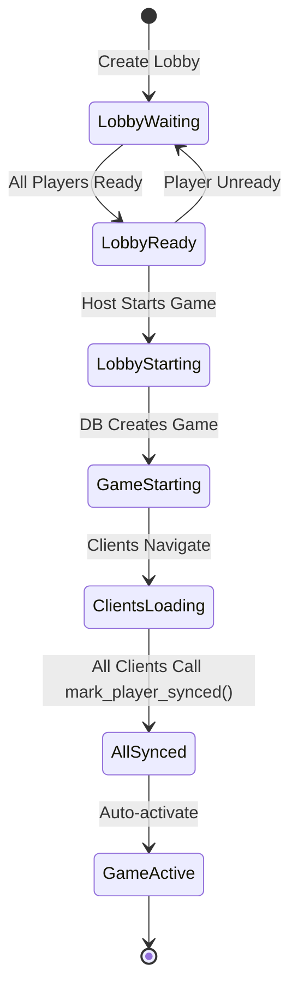

# Game Start Synchronization Implementation Plan

Comprehensive solution for ensuring proper client-server-database synchronization during game start.

## Current State Analysis

### ✅ What's Already in Place

1. **Lobby member ready flag**: `lobby_members.is_ready` exists
2. **Lobby transition states**: `lobby_status` enum has 'waiting', 'ready', 'starting', 'started'
3. **Member sync status**: `lobby_member_status` enum includes 'synced' (currently unused)
4. **Game creation function**: `start_game_from_lobby()` exists
5. **Game activation function**: `activate_game()` exists

### ❌ What's Missing

1. **Ready validation**: `start_game_from_lobby()` doesn't check if all members are ready
2. **Lobby ready state automation**: No trigger to auto-update lobby status to 'ready' when all members are ready
3. **Client sync tracking**: No mechanism to track which clients have loaded the game UI
4. **Auto-activation**: No automatic game activation once all clients are synced
5. **UI blocking mechanism**: No clear state to indicate "game is starting, please wait"

## Problem Breakdown

### Problem 1: All Members Must Be Ready

**Current Issue**: Host can call `start_game_from_lobby()` even if some members aren't ready.

**Solution**: Add validation in `start_game_from_lobby()` function.

---

### Problem 2: UI Blocking During Transition

**Current Issue**: No clear signal to clients that game start is in progress.

**Solution**: Use lobby status 'starting' to block UI, transition through states properly.

---

### Problem 3: Client Sync Before Game Activation

**Current Issue**: Game activates before all clients have loaded the game UI.

**Solution**: 
- Use `lobby_members.status = 'synced'` to track client readiness
- Auto-activate game when all members are synced
- Create `mark_player_synced()` function for clients to call

---

## Proposed Changes

### Database Functions

#### [MODIFY] `start_game_from_lobby()` - Add Ready Validation

Add validation to ensure all lobby members are ready:

```sql
-- Add this check after "Verify minimum players"
IF EXISTS (
  SELECT 1 FROM lobby_members 
  WHERE lobby_id = lobby_uuid 
  AND is_ready = false
) THEN
  RAISE EXCEPTION 'Not all players are ready';
END IF;
```

#### [NEW] `mark_player_synced()` - Client Sync Tracking

Clients call this when they've loaded the game UI:

```sql
CREATE OR REPLACE FUNCTION mark_player_synced(lobby_uuid UUID)
RETURNS void
LANGUAGE plpgsql
SECURITY DEFINER
SET search_path = public
AS $$
DECLARE
  all_synced BOOLEAN;
  game_uuid UUID;
BEGIN
  -- Mark this player as synced
  UPDATE lobby_members
  SET status = 'synced'
  WHERE lobby_id = lobby_uuid
  AND user_id = auth.uid()
  AND status = 'in_game';
  
  IF NOT FOUND THEN
    RAISE EXCEPTION 'Player not in this lobby or game not started';
  END IF;
  
  -- Check if all players are synced
  SELECT NOT EXISTS (
    SELECT 1 FROM lobby_members
    WHERE lobby_id = lobby_uuid
    AND status != 'synced'
  ) INTO all_synced;
  
  -- If all synced, activate the game
  IF all_synced THEN
    -- Get the game_id from game_players (assuming lobby members map to game players)
    SELECT gp.game_id INTO game_uuid
    FROM game_players gp
    INNER JOIN lobby_members lm ON gp.user_id = lm.user_id
    WHERE lm.lobby_id = lobby_uuid
    LIMIT 1;
    
    IF game_uuid IS NOT NULL THEN
      PERFORM activate_game(game_uuid);
    END IF;
  END IF;
END;
$$;
```

#### [NEW] Auto-Update Lobby to 'Ready' State

Trigger to automatically update lobby status when all members are ready:

```sql
CREATE OR REPLACE FUNCTION check_lobby_ready_status()
RETURNS TRIGGER
LANGUAGE plpgsql
AS $$
DECLARE
  all_ready BOOLEAN;
  min_players_met BOOLEAN;
  current_lobby_id UUID;
BEGIN
  -- Get the lobby_id from the updated row
  current_lobby_id := COALESCE(NEW.lobby_id, OLD.lobby_id);
  
  -- Check if we have minimum players and all are ready
  SELECT 
    COUNT(*) >= (SELECT min_players FROM lobbies WHERE id = current_lobby_id),
    NOT EXISTS (SELECT 1 FROM lobby_members WHERE lobby_id = current_lobby_id AND is_ready = false)
  INTO min_players_met, all_ready
  FROM lobby_members
  WHERE lobby_id = current_lobby_id;
  
  -- Update lobby status
  IF all_ready AND min_players_met THEN
    UPDATE lobbies SET status = 'ready' WHERE id = current_lobby_id AND status = 'waiting';
  ELSE
    UPDATE lobbies SET status = 'waiting' WHERE id = current_lobby_id AND status = 'ready';
  END IF;
  
  RETURN COALESCE(NEW, OLD);
END;
$$;

CREATE TRIGGER update_lobby_ready_status
  AFTER INSERT OR UPDATE OR DELETE ON lobby_members
  FOR EACH ROW EXECUTE FUNCTION check_lobby_ready_status();
```

---

## Client-Server Synchronization Flow

### State Machine



### Detailed Flow

#### Phase 1: Lobby Preparation

1. **Players join lobby**
   - `lobby_members` rows created with `is_ready = false`
   - `lobby.status = 'waiting'`

2. **Players mark themselves ready**
   - Client updates `lobby_members.is_ready = true`
   - Trigger checks if all ready + min players met
   - If yes: Auto-update `lobby.status = 'ready'`

3. **UI shows "Start Game" button**
   - Only enabled when `lobby.status = 'ready'`
   - Only visible to host

#### Phase 2: Game Start Initiation

4. **Host clicks "Start Game"**
   - Client calls `start_game_from_lobby(lobby_id)`
   - Function validates all players are ready
   - Updates `lobby.status = 'starting'` (blocks UI)
   - Creates game with `status = 'starting'`
   - Updates `lobby_members.status = 'in_game'`
   - Updates `lobby.status = 'started'`
   - Returns `game_id`

5. **All clients detect lobby.status change**
   - Subscribe to `lobbies` realtime updates
   - When `status = 'starting'`: Show loading/blocking UI
   - When `status = 'started'`: Navigate to game page

#### Phase 3: Client Synchronization

6. **Each client loads game page**
   - Fetch game data
   - Fetch game_players
   - Render initial game state
   - Show "Waiting for players..." overlay

7. **Each client reports ready**
   - Call `mark_player_synced(lobby_id)`
   - Updates `lobby_members.status = 'synced'`
   - Function checks if all players synced

8. **Last client syncs**
   - `mark_player_synced()` detects all synced
   - Auto-calls `activate_game(game_id)`
   - Updates `game.status = 'active'`
   - Sets `current_player_id`

9. **All clients detect game activation**
   - Subscribe to `games` realtime updates
   - When `status = 'active'`: Hide overlay, enable gameplay

---

## Client Implementation

### TypeScript/React Example

```typescript
// 1. Lobby Component - Subscribe to lobby status
useEffect(() => {
  const channel = supabase
    .channel(`lobby:${lobbyId}`)
    .on('postgres_changes', 
      { event: 'UPDATE', schema: 'public', table: 'lobbies', filter: `id=eq.${lobbyId}` },
      (payload) => {
        const lobby = payload.new;
        
        if (lobby.status === 'starting') {
          // Block UI - show "Starting game..."
          setIsBlocking(true);
        } else if (lobby.status === 'started') {
          // Navigate to game
          router.push(`/game/${gameId}`);
        }
      }
    )
    .subscribe();
    
  return () => { channel.unsubscribe(); };
}, [lobbyId]);

// 2. Game Component - Report when loaded
useEffect(() => {
  const loadGame = async () => {
    // Fetch game data
    const { data: game } = await supabase
      .from('games')
      .select('*')
      .eq('id', gameId)
      .single();
    
    const { data: players } = await supabase
      .from('game_players')
      .select('*, profiles(*)')
      .eq('game_id', gameId);
    
    setGameData(game);
    setPlayers(players);
    
    // Report synced
    await supabase.rpc('mark_player_synced', { lobby_uuid: lobbyId });
  };
  
  loadGame();
}, [gameId, lobbyId]);

// 3. Subscribe to game activation
useEffect(() => {
  const channel = supabase
    .channel(`game:${gameId}`)
    .on('postgres_changes',
      { event: 'UPDATE', schema: 'public', table: 'games', filter: `id=eq.${gameId}` },
      (payload) => {
        const game = payload.new;
        
        if (game.status === 'active') {
          // Hide "Waiting for players" overlay
          setIsWaiting(false);
          // Enable game controls
          setGameActive(true);
        }
      }
    )
    .subscribe();
    
  return () => { channel.unsubscribe(); };
}, [gameId]);
```

---

## Database Schema Changes Required

### 1. Update `start_game_from_lobby()` Function

Add ready validation after line 441 (after minimum players check).

### 2. Add `mark_player_synced()` Function

New function for clients to report when loaded.

### 3. Add Auto-Ready Trigger

Automatically update lobby to 'ready' when conditions met.

### 4. Optional: Add Game-Lobby Link

For easier game lookup from lobby:

```sql
ALTER TABLE lobbies ADD COLUMN game_id UUID REFERENCES games(id);
```

Update `start_game_from_lobby()` to set this field.

---

## Verification Plan

### 1. Database Testing

```sql
-- Test ready validation
-- Should fail:
SELECT start_game_from_lobby('<lobby_id>'); 

-- Mark all ready
UPDATE lobby_members SET is_ready = true WHERE lobby_id = '<lobby_id>';

-- Should succeed:
SELECT start_game_from_lobby('<lobby_id>');
```

### 2. Client Sync Testing

1. Open game in 3 browser tabs (3 players)
2. All mark ready
3. Host starts game
4. Verify all tabs show "Starting..." UI
5. Verify all tabs navigate to game page
6. Verify game shows "Waiting for players..."
7. Verify game activates when all tabs loaded
8. Verify no tab can interact until status = 'active'

### 3. Edge Cases

- **Player disconnects during start**: Needs timeout mechanism
- **Player never syncs**: Add timeout to auto-activate after 10s
- **Race conditions**: Test with slow networks
- **Network interruption**: Test reconnection logic

---

## Summary

### Current Gaps

| Requirement | Status | Solution |
|------------|--------|----------|
| All members ready check | ❌ Missing | Add validation to `start_game_from_lobby()` |
| UI blocking during start | ⚠️ Partial | Use lobby status transitions + realtime |
| Client sync tracking | ❌ Missing | Implement `mark_player_synced()` + trigger |
| Auto lobby ready | ❌ Missing | Add trigger on `lobby_members` changes |
| Auto game activation | ❌ Missing | Logic in `mark_player_synced()` |

### What to Implement

1. ✅ Database changes (3 new functions, 1 trigger, validation)
2. ✅ Client-side realtime subscriptions (lobby + game)
3. ✅ Client-side sync reporting (call `mark_player_synced()`)
4. ✅ UI state management (blocking, waiting, active)
